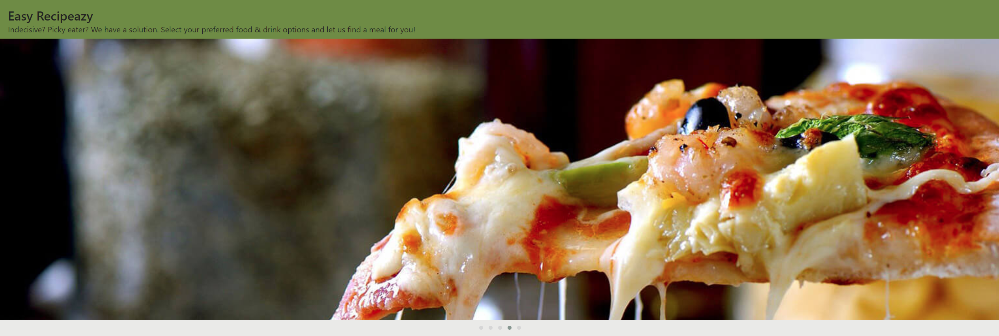
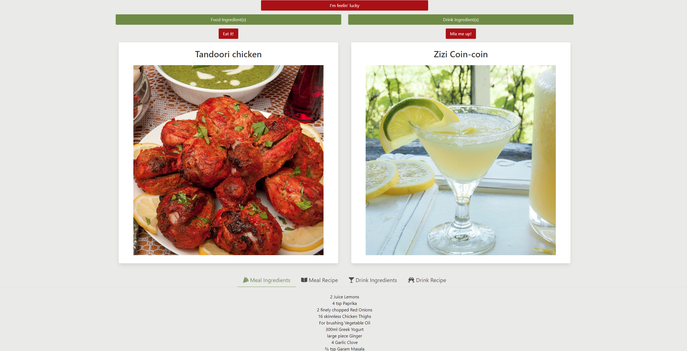

# Dinner and a Drink?
*Meal and Drink Randomizer with Bulma, Carousel.js, AJAX, jQuery, Regex and localStorage*  

[View Deployed Application Here.](https://tonipow3ll.github.io/drinks-and-dinner/)

## Installation
1. Clone repository to your local device
2. Test by opening the index.html file in your browser. If it looks good, it's working right.
3. If it does not work, right-click Inspect console to determine if there is an Error with the API.

## User Story
```
GIVEN a user wants a meal or drink recipe
WHEN I visit a webpage
THEN I find buttons to randomly generate meals
WHEN I click "Feelin' Lucky"
THEN I randomly generate both a meal and a drink
WHEN I click an "Ingredient(s)" button
THEN I find a list of ingredients I can choose from
WHEN I make an ingredient button green
THEN recipes show up with that ingredient
WHEN I make an ingredient button red
THEN recipes show up that do not have that ingredient
WHEN I click the 'Eat it!' button
THEN a randomly selected meal will generate, regardless of if I have selected specific ingredients
WHEN I click the 'Mix me up!' button
THEN a randomly selected drink will generate, regardless of if I have selected specific ingredients
WHEN I scroll down the page
THEN I see a tab with four titles "Meal Ingredients | Meal Recipe | Drink Ingredients | Drink Recipe"
WHEN I click one of these tabs
THEN I can intuitively find the ingredients and recipe for each meal or drink I am looking for
```

## How to Use
1. Click "I'm feelin' lucky" to randomly generate both a Meal and a Drink.
2. Click 'Food Ingredient(s)' or 'Drink Ingredient(s)' to select specific ingredients you may have lying around the house.
3. Looking at Ingredients, click once (green button) to find a recipe with that ingredient. Click again (red button) to find a recipe without that ingredient.
4. After selecting ingredients, click 'Eat it!' and/or 'Mix me up!' buttons.
5. Click Meal/Drink Ingredients/Recipe tabs below image cards to find ingredients required for each item, as well as instructions for recreation.
6. Enjoy :)

## Usage
This repo is a Group Project created by Toni Powell, Cathy Marchese, Bjorn Yourey, Ryan Royalty and Jonathan Hammond. Feel free to inspect the code and notice how we made a Meal and Drink Randomizer, with a Specific Ingredient Selection feature:
- HTML built with Bulma CSS Framework's simple grid system
- Fully Responsive Slider with older browser support, courtesy of Owl Carousel 2
- Accessible color palette with intuitive element positioning for a simple and intuitive user experience
- Utilization of Tabs to conserve page room by overlapping 4 corresponding columns
- Custom ingredient selector with built-in search bar 
- Like/dislike functionality to enhance search results
- Regular Expression (Regex) search patterns to filter similar object keys
- Usage of localStorage for saved preferences

## Credits
[jQuery hasClass()](https://api.jquery.com/hasclass/)

[selecting singular queries in jQuery](https://stackoverflow.com/questions/307500/how-do-i-select-a-single-element-in-jquery)

[jQuery attr()](https://www.w3schools.com/jquery/html_attr.asp#:~:text=The%20attr()%20method%20sets,the%20set%20of%20matched%20elements.)

[Bulma is-active](https://bulma.io/documentation/components/navbar/)

[output in pretty print way](https://stackoverflow.com/questions/16862627/json-stringify-output-to-div-in-pretty-print-way)

[HTML 5 elements that can be nested inside P element](https://stackoverflow.com/questions/9852312/list-of-html5-elements-that-can-be-nested-inside-p-element)

[jsFiddle for `<pre>`](http://jsfiddle.net/K83cK/)

[MDN, `<pre>`: The Preformatted Text element](https://developer.mozilla.org/en-US/docs/Web/HTML/Element/pre)

[Array.prototype.slice()](https://developer.mozilla.org/en-US/docs/Web/JavaScript/Reference/Global_Objects/Array/slice)

[regex](https://regexr.com/)

[git pull from master into the development branch](https://stackoverflow.com/questions/20101994/git-pull-from-master-into-the-development-branch)

[jQuery $("[attribute=value]")](https://www.w3schools.com/jquery/sel_attribute_equal_value.asp)

[3 Methods to Loop Over Object Properties in JavaScript in Seconds](https://itnext.io/x1f4f9-3-ways-to-loop-over-object-properties-with-vanilla-javascript-es6-included-efb4a68cfbb)

[String.prototype.match()](https://developer.mozilla.org/en-US/docs/Web/JavaScript/Reference/Global_Objects/String/match)

[looping with regex](https://stackoverflow.com/questions/51086287/regex-for-phrase-searching)

[dynamically creating variables](https://stackoverflow.com/questions/6645067/javascript-dynamically-creating-variables-for-loops)

[Arrays and Math.random()](https://medium.com/front-end-weekly/getting-a-random-item-from-an-array-43e7e18e8796)

[Arrays as Keys in Objects](https://stackoverflow.com/questions/17769934/need-to-use-value-of-an-html-select-option-as-an-array-name)

[Why won't my `<select>` show on screen](https://stackoverflow.com/questions/37700001/select-tag-doesnt-display-on-my-form)

[HTML `<select>` Tag](https://www.w3schools.com/tags/tag_select.asp)

[$(document).ready() to assure jQuery Fires after document page load](https://learn.jquery.com/using-jquery-core/document-ready/)

[TheMealDB](https://www.themealdb.com/api.php)

[TheCocktailDB](https://www.thecocktaildb.com/)

[Postman for easy API calls](https://web.postman.co/)

[Site Inspiration for Recipe Finding](https://reciperoulette.tv/)

[JSON Formatter and Validator](https://jsonformatter.curiousconcept.com/#)

[Changing Image Source Using jQuery](https://www.tutorialrepublic.com/faq/how-to-change-the-image-source-using-jquery.php)

[jQuery css()](https://www.w3schools.com/jquery/jquery_css.asp)

## Future Improvements
Tapping an ingredient button twice assigns it a 'dislike' value in localStorage to prevent recipes from showing up. However double tapping the zooms in the screen on mobile. This should be fixed to improve UX

Carousel images are different sizes. Because of this, the slider increases and decreases in height every transition. Having no set width/heights also gets docked in Lighthouse. Re-formatting images will improve UX & Lighthouse score.

Header might look nicer if heading information was overlapped onto the Carousel images. Also, might be worth testing to add social media icons (for sharing) somewhere on the cards, or maybe the navbar, fixed to the side, etc.

When a card title's line length is longer than the one right next to it, it results in cards having different heights and looking slightly uneven. It might be worth looking into max-height or possibly the CSS clamp() property to prevent this from happening.

Add an 'i' information bubble that pops open a modal when clicked for how to use, about the project, etc.

Re-arrange the mobile layout. One thought that sticks out: try to stick each meal card within another tab component. This way, one would not have to be stacked over one another on the y axis. Z axis may look better, but inevitably it would be one over the other. Also, reducing and experimenting with different button sizes and layout would be a big to do, as the landing page is not as intuitive as it can be.

Finding a different tab layout for mobile would probably also enhance user experience. Currently, Each list item is stacked over one another, but the corresponding data-content shows up below the entire list. It may be worth testing an accordion on mobile, but this is still really great looking.

Experimentation with Webpack (and future classes cover node also) may also provide a boost to performance by reducing total number of requests count.

Add a <meta> description tag, increase background:foreground color contrast and finish adding button labels to resolve accessibility issues.

Add attributes to anchor tags in the #tabs section to make for crawlable links.
  
## License
We've chosen an MIT License. Do what you'd like with this material, but make sure to visit [TheMealDB](https://www.themealdb.com/api.php) and [TheCocktailDB](https://www.thecocktaildb.com/) to read the documentation, and if you'd like to show them some love, become one of their [Patreon](https://www.patreon.com/thedatadb) supporters as well!

#### The Website


